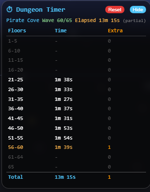
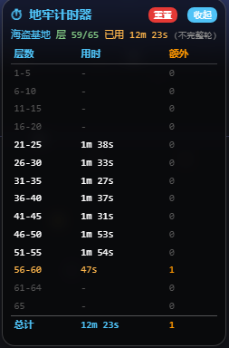

# Dungeon Floor Timer / 地牢计时器

**[English](#features)** | **[中文说明](#中文说明)**

A [Tampermonkey](https://www.tampermonkey.net/) userscript for [Milky Way Idle](https://www.milkywayidle.com/) that tracks dungeon run times per 5-floor group with **speedrun-style comparison** and **extra boss spawn tracking**.

Supports both **English** and **Chinese** — auto-detects game language and switches dynamically.

[](https://greasyfork.org/scripts/XXXXX)

---

## Features

### ⏱ Floor Group Timing

Times each 5-floor group (1-5, 6-10, ...). The **final boss wave** is shown as its own row.

### 📊 Speedrun Comparison (Diff Column)

After your first complete run, every subsequent run shows:

- 🟢 **-Xm Xs** (green) — faster than average
- 🔴 **+Xm Xs** (red) — slower than average
- Grey — within 1 second

### 👹 Extra Boss Spawns

Counts boss appearances on **non-fixed waves** (not multiples of 5). These random mini-boss spawns can slow your run.

### 🛡 Smart Data Handling

- **Mid-dungeon join**: Waits for next clean 5-floor boundary before recording. Partial runs excluded from averages.
- **Complete runs only**: Only runs starting from wave 1 are saved to history.
- **Persistent storage**: Complete run data saved to `localStorage` — survives page refresh.
- **Draggable panel**: Move it anywhere. Collapse/expand with a button.

---

## Screenshots

**Mid-dungeon join (waiting for alignment):**



**Multiple runs with comparison:**

`[screenshot: multi_run.png]`

---

## Reading the Panel

```
⏱ Dungeon Timer                          [Reset] [Hide]
Pirate Cove  Wave 65/65  Elapsed 19m 25s

Floors  Time     Avg      Diff    Extra  Avg
1-5     47s      52s      -4s     0      0.0
6-10    1m 20s   1m 16s   +3s     0      0.0
11-15   1m 11s   1m 16s   -4s     0      0.0
16-20   1m 5s    1m 0s    +4s     0      0.0
21-25   1m 44s   1m 41s   +2s     0      0.0
26-30   1m 25s   1m 28s   -2s     0      0.0
31-35   1m 34s   1m 33s   -       0      0.0
36-40   1m 25s   1m 39s   -14s    0      0.0
41-45   1m 43s   1m 50s   -6s     1      1.0
46-50   1m 43s   1m 47s   -3s     0      0.7
51-55   2m 14s   2m 7s    +6s     1      1.3
56-60   1m 57s   2m 3s    -5s     1      1.0
61-64   1m 11s   1m 35s   ...     1      0.3
65      —        —        —       —      —
Total   19m 25s  21m 13s  -1m 47s 3      4.3

History (3 runs)
[17:17] Pirate Cove 20m 52s
[16:56] Pirate Cove 21m 38s
[16:35] Pirate Cove 21m 8s
```

| Column          | Meaning                                           |
|-----------------|---------------------------------------------------|
| **Floors**      | 5-floor group range (final boss wave is separate) |
| **Time**        | Time spent on this group in the current run       |
| **Avg**         | Average time across all completed runs            |
| **Diff**        | Difference vs average (🟢 faster / 🔴 slower)     |
| **Extra**       | Boss spawns on non-fixed waves in this group      |
| **Avg** (Extra) | Average extra boss spawns per run                 |

**Row colors:**

- 🟠 Orange — currently active group
- ⚪ White — completed group
- 🔘 Grey — future (not yet reached)

---

## Supported Dungeons

| Dungeon                       | Floors | Final Boss      | Tracked Bosses                                     |
|-------------------------------|--------|-----------------|----------------------------------------------------|
| Chimerical Den / 奇幻洞穴     | 50     | Griffin         | Jackalope (30+)                                    |
| Sinister Circus / 阴森马戏团  | 60     | Deranged Jester | Zombie Bear (40+)                                  |
| Enchanted Fortress / 秘法要塞 | 65     | Queen + King    | *(none — no bosses in random pool)*                |
| Pirate Cove / 海盗基地        | 65     | The Kraken      | Anchor Shark, Brine Marksman, Tidal Conjuror (40+) |

> **Note:** Only bosses that appear in the game's random spawn pool are tracked. Many bosses (Manticore, Dodocamel, Magician, Juggler, Acrobat, Knight, Bishop, Rook) only spawn on fixed waves (multiples of 5) and are not tracked. Weak bosses (Squawker, Butterjerry, Rabid Rabbit, Enchanted Pawn) are also excluded.

---

## Installation

1. Install [Tampermonkey](https://www.tampermonkey.net/)
2. Install from [Greasy Fork](https://greasyfork.org/scripts/XXXXX) or create a new script and paste [`dungeon-floor-timer.user.js`](dungeon-floor-timer.user.js)
3. Refresh the game page

> ⚠️ The script must run at `document-start` to intercept WebSocket messages.

---

## How It Works

The script wraps the game's WebSocket to intercept:

| Message                 | Purpose                                              |
|-------------------------|------------------------------------------------------|
| `new_battle`            | Wave number + monster list (timing & boss detection) |
| `init_character_data`   | Detect which dungeon is active                       |
| `chat_message_received` | Detect dungeon end via party system messages         |

No data is sent externally. Everything stays in your browser.

---

## License

MIT

---

# 中文说明

银河奶牛放置（Milky Way Idle）地牢计时器插件，追踪每5层的通关时间，支持 **Speedrun风格对比** 和 **额外Boss刷新统计**。

自动检测游戏语言，支持**中英文动态切换**。

---

## 功能

### ⏱ 每5层分组计时

自动按5层分组计时（1-5, 6-10, ...），最后一层Boss单独一行显示。

### 📊 Speedrun对比

从第二轮开始，每组时间会和历史平均对比：

- 🟢 绿色 `-Xm Xs` = 比平均快
- 🔴 红色 `+Xm Xs` = 比平均慢
- 灰色 = 差距不到1秒

### 👹 额外Boss统计

统计在非5的倍数层出现的Boss次数（随机小Boss刷新），帮助了解运气对通关时间的影响。

### 🛡 智能数据处理

- **中途进入**：等待下一个完整5层组才开始计时，不完整轮不计入历史
- **仅保存完整轮**：只有从第1波开始的完整轮才存入历史
- **持久化存储**：完整轮数据保存到 localStorage，刷新页面不丢失
- **可拖动面板**：随意拖动位置，支持收起/展开

---

## 截图

**中途进入（等待对齐）：**



**多轮运行（带对比）：**

`[截图占位: multi_run.png]`

---

## 面板说明

```
⏱ 地牢计时器                             [重置] [收起]
海盗基地  层 65/65  已用 19m 25s

层数    用时     均时     对比     额外  均
1-5     47s      52s      -4s      0     0.0
6-10    1m 20s   1m 16s   +3s      0     0.0
11-15   1m 11s   1m 16s   -4s      0     0.0
16-20   1m 5s    1m 0s    +4s      0     0.0
21-25   1m 44s   1m 41s   +2s      0     0.0
26-30   1m 25s   1m 28s   -2s      0     0.0
31-35   1m 34s   1m 33s   -        0     0.0
36-40   1m 25s   1m 39s   -14s     0     0.0
41-45   1m 43s   1m 50s   -6s      1     1.0
46-50   1m 43s   1m 47s   -3s      0     0.7
51-55   2m 14s   2m 7s    +6s      1     1.3
56-60   1m 57s   2m 3s    -5s      1     1.0
61-64   1m 11s   1m 35s   ...      1     0.3
65      —        —        —        —     —
总计    19m 25s  21m 13s  -1m 47s  3     4.3

历史 (3轮)
[17:17] 海盗基地 20m 52s
[16:56] 海盗基地 21m 38s
[16:35] 海盗基地 21m 8s
```

| 列名     | 含义                          |
|----------|-------------------------------|
| **层数** | 5层分组（最终Boss单独一行）     |
| **用时** | 当前轮该组耗时                |
| **均时** | 所有完整轮的平均耗时          |
| **对比** | 与平均的差值（🟢快了 / 🔴慢了） |
| **额外** | 非固定层Boss出现次数          |
| **均**   | 历史平均额外Boss次数          |

**行颜色：** 🟠 橙色 = 当前组 · ⚪ 白色 = 已完成 · 🔘 灰色 = 未到达

---

## 支持的地牢

| 地牢       | 层数 | 最终Boss      | 追踪的Boss                       |
|------------|------|---------------|----------------------------------|
| 奇幻洞穴   | 50   | 狮鹫          | 鹿角兔 (30+)                     |
| 阴森马戏团 | 60   | 小丑皇        | 僵尸熊 (40+)                     |
| 秘法要塞   | 65   | 秘法王后+国王 | *（无 — 没有Boss在随机池中）*      |
| 海盗基地   | 65   | 克拉肯        | 持锚鲨、海盐射手、潮汐召唤师 (40+) |

> **注意：** 只追踪存在于游戏随机怪物池中的Boss。很多Boss（蝎狮、渡渡骆驼、魔术师、杂耍师、杂技师、秘法骑士、秘法主教、秘法城堡）只在固定层（5的倍数层）出现，不会随机刷新。弱Boss（鹦鹉、蝴蝶杰瑞、疯兔、秘法兵）虽在随机池中但已排除。

---

## 安装

1. 安装 [Tampermonkey](https://www.tampermonkey.net/) 浏览器扩展
2. 从 [Greasy Fork](https://greasyfork.org/scripts/XXXXX) 安装，或新建脚本粘贴 [`dungeon-floor-timer.user.js`](dungeon-floor-timer.user.js)
3. 刷新游戏页面

> ⚠️ 脚本必须在 `document-start` 运行以拦截 WebSocket 消息。

---

## 工作原理

通过包装游戏的 WebSocket 连接拦截消息：

| 消息类型                | 用途                                  |
|-------------------------|---------------------------------------|
| `new_battle`            | 获取波次号和怪物列表（计时 + Boss检测） |
| `init_character_data`   | 检测当前地牢                          |
| `chat_message_received` | 检测地牢结束（队伍系统消息）            |

所有数据仅保存在浏览器本地，不会发送到外部。
